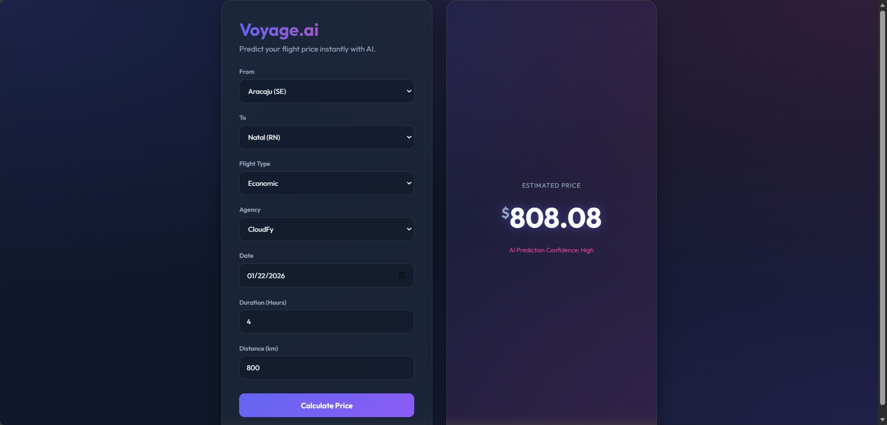

# Voyager MLOps Project

Voyager is a comprehensive MLOps project focusing on predictive analytics for travel and user data. It covers regression, classification, and recommendation system scenarios, integrated with modern MLOps tools.





## Project Structure

```text
Voyage/
├── dataset/                    # Shared dataset directory (users, flights, hotels)
├── docs/                       # Project Documentation Suite & Reports
│   ├── 01_FINAL_PROJECT_REPORT.md
│   ├── 02_INTERVIEW_QA_PREPARATION.md
│   ├── 03_DEPLOYMENT_AND_RUNBOOK.md
│   └── 04_EVALUATION_RUBRIC_COMPLIANCE.md
├── flight_price/               # Scenario 1: Regression (Flight Price Prediction + MLOps)
├── gender_classification/      # Scenario 2: Classification (User Gender)
├── travel_recommendation/      # Scenario 3: Recommendation & Streamlit Dashboard
└── picture/                    # Project screenshots and diagrams
```

## Documentation & Submission Suite

All project submission documents are located in the [`docs/`](docs/) directory:

- [**01. Final Technical Capstone Report**](docs/01_FINAL_PROJECT_REPORT.md): In-depth system architecture, dataset relationships, model performance metrics, and MLOps implementation.
- [**02. Interview Q&A Preparation Guide**](docs/02_INTERVIEW_QA_PREPARATION.md): Comprehensive answers to core follow-up questions (real-time serving, K8s/Docker rationale, MLflow, retraining, scalability).
- [**03. Deployment & Operational Runbook**](docs/03_DEPLOYMENT_AND_RUNBOOK.md): Step-by-step reproduction guide for local setup, Docker builds, Kubernetes deployment, Airflow DAGs, and Streamlit.
- [**04. Evaluation Rubric Compliance Matrix**](docs/04_EVALUATION_RUBRIC_COMPLIANCE.md): 100% compliance breakdown across all evaluation criteria.

## Scenarios Overview

### 1. Flight Price Prediction (`flight_price/`)
- **Type**: Regression (`XGBRegressor` + `RandomizedSearchCV`)
- **Objective**: Predict flight price dynamically based on distance, elapsed time, flight type, agency, and date.
- **MLOps Integrations**: MLflow Experiment Tracking, Docker Containerization, Kubernetes Orchestration (2 replicas + LoadBalancer), Apache Airflow Automated Retraining DAG, Jenkins CI/CD.

### 2. Gender Classification (`gender_classification/`)
- **Type**: Classification (`RandomForestClassifier`)
- **Objective**: Categorize user demographics based on age, company, and custom name n-gram morphological features.
- **MLOps Integrations**: Flask REST API (`/classify`), Docker Containerization.

### 3. Travel Recommendation (`travel_recommendation/`)
- **Type**: Recommendation System (`TruncatedSVD` Collaborative Filtering)
- **Objective**: Deliver personalized top-10 hotel recommendations and global travel intelligence.
- **Features**: Interactive Streamlit Dashboard (`/`), user-level personalization, and macro-level price & destination analytics.

## Global Setup & Quick Start

1. **Clone the repository:**
   ```bash
   git clone <repository-url>
   cd "Voyage Analytics Integrating MLOps in Travel"
   ```
2. **Install requirements:**
   ```bash
   pip install -r requirements.txt
   ```
3. **Train All Models:**
   ```bash
   python flight_price/src/train.py
   python gender_classification/src/train.py
   python travel_recommendation/src/train.py
   ```
4. **Launch Applications:**
   - Flight Price REST API: `python flight_price/src/app.py` (Port 5000)
   - Gender Classification API: `python gender_classification/src/app.py` (Port 5001)
   - Travel Recommendation Dashboard: `streamlit run travel_recommendation/src/app.py` (Port 8501)

