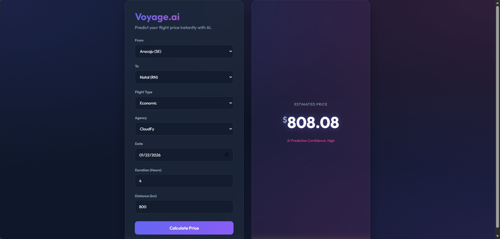
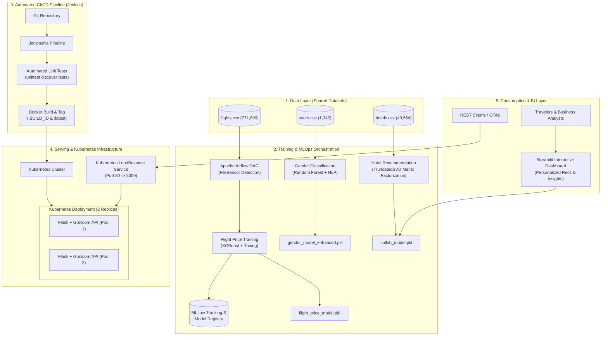

# Voyage Analytics: Integrating MLOps in Travel



**Voyage Analytics** is an end-to-end Machine Learning Operations (MLOps) platform designed for the travel and tourism industry. The platform unifies three intelligent capabilities—**Flight Price Prediction (Regression)**, **User Demographic Profiling (Classification)**, and **Personalized Hotel Recommendations (Collaborative Filtering)**—and integrates them into a production-grade cloud-native ecosystem with **MLflow**, **Docker**, **Kubernetes**, **Apache Airflow**, **Jenkins**, **Flask**, and **Streamlit**.

---

## 🏛️ End-to-End System Architecture


```mermaid
flowchart TD
    subgraph Data_Layer ["1. Data Layer (Shared Datasets)"]
        UsersData[("users.csv (1,342)")]
        FlightsData[("flights.csv (271,890)")]
        HotelsData[("hotels.csv (40,554)")]
    end

    subgraph MLOps_Orchestration ["2. Training & MLOps Orchestration"]
        Airflow["Apache Airflow DAG\n(FileSensor Detection)"]
        FlightsData --> Airflow
        Airflow --> TrainReg["Flight Price Training\n(XGBoost + Tuning)"]
        TrainReg --> MLflow[("MLflow Tracking &\nModel Registry")]
        TrainReg --> FlightModel["flight_price_model.pkl"]
        UsersData --> TrainClf["Gender Classification\n(Random Forest + NLP)"] --> GenderModel["gender_model_enhanced.pkl"]
        HotelsData --> TrainRec["Hotel Recommendation\n(TruncatedSVD Matrix Factorization)"] --> RecModel["collab_model.pkl"]
    end

    subgraph CICD_Pipeline ["3. Automated CI/CD Pipeline (Jenkins)"]
        GitRepo["Git Repository"] --> Jenkins["Jenkinsfile Pipeline"]
        Jenkins --> UnitTests["Automated Unit Tests\n(unittest discover tests)"]
        UnitTests --> DockerBuild["Docker Build & Tag\n(:BUILD_ID & :latest)"]
    end

    subgraph Cloud_Deployment ["4. Serving & Kubernetes Infrastructure"]
        DockerBuild --> K8sCluster["Kubernetes Cluster"]
        subgraph K8s_Pods ["Kubernetes Deployment (2 Replicas)"]
            Pod1["Flask + Gunicorn API (Pod 1)"]
            Pod2["Flask + Gunicorn API (Pod 2)"]
        end
        K8sCluster --> K8s_Pods
        K8sService["Kubernetes LoadBalancer Service\n(Port 80 -> 5000)"] --> K8s_Pods
    end

    subgraph User_Applications ["5. Consumption & BI Layer"]
        Client["REST Clients / OTAs"] --> K8sService
        StreamlitApp["Streamlit Interactive Dashboard\n(Personalized Recs & Insights)"] --> RecModel
        EndUser["Travelers & Business Analysts"] --> StreamlitApp
    end
```

---

## 📁 Repository Structure

```text
Voyage Analytics Integrating MLOps in Travel/
├── dataset/                         # Shared relational datasets
│   ├── flights.csv                  # 271,890 flight transaction records
│   ├── hotels.csv                   # 40,554 lodging booking records
│   └── users.csv                    # 1,342 customer demographic records
├── docs/                            # Project Documentation & Reports Suite
│   ├── 01_FINAL_PROJECT_REPORT.md   # Comprehensive Technical Capstone Report
│   ├── 02_INTERVIEW_QA_PREPARATION.md # Follow-up & Viva Q&A Guide
│   ├── 03_DEPLOYMENT_AND_RUNBOOK.md # Operational Deployment & Execution Runbook
│   └── 04_EVALUATION_RUBRIC_COMPLIANCE.md # 100% Evaluation Criteria Compliance Matrix
├── flight_price/                    # Scenario 1: Flight Price Prediction (Regression + MLOps)
│   ├── airflow/dags/training_dag.py # Apache Airflow automated retraining DAG
│   ├── k8s/deployment.yaml          # Kubernetes 2-replica Deployment & Service
│   ├── models/                      # Serialized model artifacts
│   ├── notebooks/flight_analysis.ipynb # Exploratory Data Analysis & experiments
│   ├── src/app.py                   # Flask REST API & Web UI
│   ├── src/train.py                 # XGBoost training pipeline + MLflow tracking
│   ├── Dockerfile                   # Container definition with Gunicorn WSGI
│   ├── Jenkinsfile                  # 5-stage declarative CI/CD delivery pipeline
│   └── README.md                    # Dedicated scenario documentation
├── gender_classification/           # Scenario 2: Demographic Profiling (Classification)
│   ├── models/                      # Serialized Random Forest model
│   ├── notebooks/gender_analysis.ipynb # Demographic EDA & NLP feature analysis
│   ├── src/app.py                   # Flask REST API & Web UI
│   ├── src/train.py                 # Feature engineering & Random Forest training
│   ├── Dockerfile                   # Container definition with Gunicorn
│   └── README.md                    # Dedicated scenario documentation
├── travel_recommendation/           # Scenario 3: Hotel Recommendation & Dashboard
│   ├── models/                      # SVD collaborative filtering & metadata artifacts
│   ├── notebooks/recommendation_analysis.ipynb # Recommendation algorithms & evaluation
│   ├── src/app.py                   # Streamlit interactive BI dashboard
│   ├── src/train.py                 # TruncatedSVD matrix factorization pipeline
│   ├── Dockerfile                   # Streamlit container definition
│   └── README.md                    # Dedicated scenario documentation
├── tests/                           # Automated unit testing suite
│   └── test_api.py                  # API endpoint & input validation unit tests
├── picture/                         # Architecture diagrams & UI screenshots
├── requirements.txt                 # Global Python dependency specifications
└── README.md                        # Master repository documentation
```

---

## 🎯 Scenarios & Machine Learning Models

### 1. Flight Price Prediction (`flight_price/`)
- **Task**: Regression
- **Algorithm**: `XGBRegressor` optimized with `RandomizedSearchCV` (3-fold cross-validation).
- **Features**: Date decomposition (`month`, `day`, `weekday`), `StandardScaler` (distance, duration), and `OneHotEncoder(handle_unknown='ignore')` (origin, destination, cabin class, agency).
- **Evaluation Metrics**: RMSE, MAE, R² Score.
- **MLOps Stack**: MLflow, Docker, Kubernetes (2 replicas + LoadBalancer), Apache Airflow DAG, Jenkins CI/CD.
- 👉 [Read Detailed Flight Price Documentation](flight_price/README.md)

### 2. Gender Classification (`gender_classification/`)
- **Task**: Multi-class Classification
- **Algorithm**: `RandomForestClassifier` with hyperparameter tuning.
- **Feature Engineering**: Custom morphological n-gram linguistic extraction on names (`name_len`, `name_start`, `name_end`, `name_last2`) combined with `age` and `company`.
- **Serving**: Flask REST API on port `5001`.
- 👉 [Read Detailed Gender Classification Documentation](gender_classification/README.md)

### 3. Travel Recommendation Engine (`travel_recommendation/`)
- **Task**: Recommender System & Business Intelligence
- **Algorithm**: Collaborative Filtering via Matrix Factorization (**TruncatedSVD**, $k=20$ latent components).
- **Features**: User-Hotel sparse interaction matrix; dot-product affinity scoring ($\mathbf{u} \cdot \mathbf{V}^T$) ranking top-10 personalized hotel recommendations.
- **User Interface**: Interactive **Streamlit** dashboard displaying personalized recommendations, price distributions by city, and destination popularity metrics.
- 👉 [Read Detailed Travel Recommendation Documentation](travel_recommendation/README.md)

---

## ⚙️ MLOps Toolchain & Workflow Automation

| MLOps Component | Technology | Configuration & Role |
|---|---|---|
| **Experiment Tracking** | **MLflow** | Tracks hyperparameter grids, test metrics (`rmse`, `mae`, `r2`), and registers model pipeline artifacts. |
| **Containerization** | **Docker** | Packages lightweight images (`python:3.11-slim`) with **Gunicorn** WSGI multi-worker concurrency. |
| **Container Orchestration** | **Kubernetes** | 2-replica Deployment with CPU/memory resource limits/requests and `LoadBalancer` Service. |
| **Workflow Automation** | **Apache Airflow** | DAG `flight_price_training_pipeline` with `FileSensor` detecting new data files and triggering automated retraining. |
| **Continuous Delivery** | **Jenkins** | 5-stage declarative `Jenkinsfile` executing checkout, dependency install, unit tests, Docker build, and K8s rollout. |
| **Automated Testing** | **Python `unittest`** | Automated testing in `tests/test_api.py` validating API health and validation gates. |

---

## 🚀 Quick Start & Execution Guide

### 1. Local Environment Setup:
```bash
# Clone the repository
git clone <repository-url>
cd "Voyage Analytics Integrating MLOps in Travel"

# Create and activate virtual environment
python -m venv .venv
source .venv/bin/activate   # On Windows: .\.venv\Scripts\Activate.ps1

# Install dependencies
pip install -r requirements.txt
```

### 2. Train All Models & Generate Artifacts:
```bash
# Train Flight Price model & log to MLflow
python flight_price/src/train.py

# Train Gender Classification model
python gender_classification/src/train.py

# Train Travel Recommendation collaborative model
python travel_recommendation/src/train.py
```

### 3. Run Automated Tests:
```bash
python -m unittest discover tests
```

### 4. Launch Applications Locally:
```bash
# Flight Price REST API (Port 5000)
python flight_price/src/app.py

# Gender Classification REST API (Port 5001)
python gender_classification/src/app.py

# Travel Recommendation Streamlit Dashboard (Port 8501)
streamlit run travel_recommendation/src/app.py

# MLflow Experiment Tracking UI (Port 5050)
mlflow ui --backend-store-uri "file:///$(pwd)/flight_price/mlruns" --port 5050
```

### 5. Run with Docker:
```bash
# Flight Price Container
docker build -t flight-price-api -f flight_price/Dockerfile .
docker run -d -p 5000:5000 flight-price-api

# Travel Recommendation Container
docker build -t travel-rec-app -f travel_recommendation/Dockerfile .
docker run -d -p 8501:8501 travel-rec-app
```

### 6. Deploy to Kubernetes:
```bash
kubectl apply -f flight_price/k8s/deployment.yaml
kubectl rollout status deployment/flight-price-api
```

---

## 📚 Submission & Documentation Suite

Detailed technical reports and operational guides are available in the [`docs/`](docs/) directory:
- [**01. Final Technical Capstone Report**](docs/01_FINAL_PROJECT_REPORT.md): Comprehensive system specification, dataset relationships, mathematical formulations, and evaluation metrics.
- [**02. Interview Q&A Preparation Guide**](docs/02_INTERVIEW_QA_PREPARATION.md): In-depth answers to core follow-up questions (real-time serving, K8s/Docker rationale, MLflow, retraining, multi-region scaling).
- [**03. Deployment & Operational Runbook**](docs/03_DEPLOYMENT_AND_RUNBOOK.md): Step-by-step reproduction and operational runbook for cloud and local deployments.
- [**04. Evaluation Rubric Compliance Matrix**](docs/04_EVALUATION_RUBRIC_COMPLIANCE.md): 100% compliance breakdown across all 6 grading criteria.
