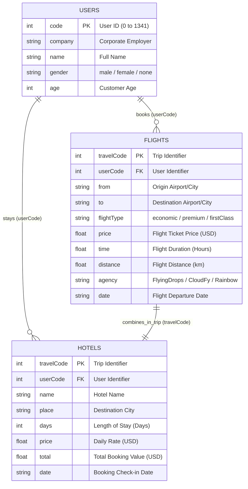
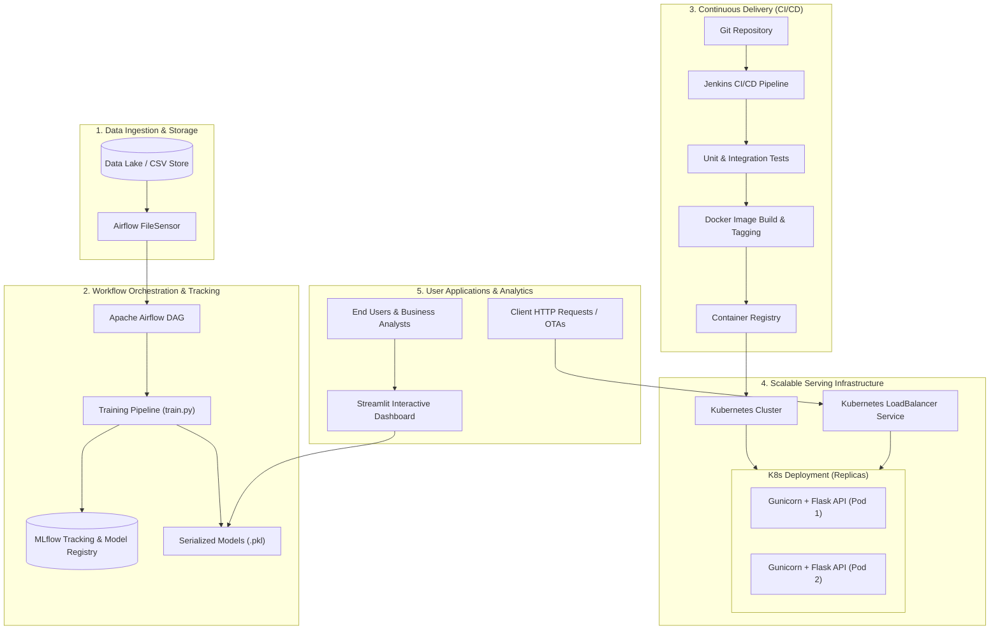

# Voyage Analytics: Integrating MLOps in Travel
# Comprehensive Final Project Report & Capstone Technical Specification

---

## 1. Executive Summary

**Voyage Analytics** is an enterprise-grade Machine Learning Operations (MLOps) platform designed to power predictive intelligence and personalization across the travel and tourism industry. Operating at the confluence of predictive modeling, data engineering, and cloud-native infrastructure, the system unifies three core machine learning capabilities:
1. **Flight Price Prediction (Regression):** Dynamic price forecasting utilizing gradient boosted decision trees (`XGBRegressor`) with automated hyperparameter optimization and temporal feature engineering.
2. **User Demographic Categorization (Classification):** Predictive customer profiling using an ensemble `RandomForestClassifier` equipped with custom linguistic n-gram extractors.
3. **Personalized Hotel Recommendation (Collaborative Filtering):** Latent factor recommendation engine powered by Truncated Singular Value Decomposition (SVD) matrix factorization, exposed via an interactive Streamlit business intelligence dashboard.

To transition these models from experimental prototypes into high-availability production assets, the platform implements a complete MLOps ecosystem encompassing **MLflow** for experiment tracking, **Docker** for containerization, **Kubernetes** for container orchestration and autoscaling, **Apache Airflow** for automated DAG-based data ingestion and model retraining, and **Jenkins** for Continuous Integration and Continuous Deployment (CI/CD).

---

## 2. Business Context & Problem Statement

### 2.1 The Industry Challenge
In modern online travel agencies (OTAs) and flight aggregators, travel pricing is volatile and non-linear, influenced by booking lead times, route popularity, agency strategies, and cabin classes. Static heuristic pricing results in lost conversion opportunities or eroded profit margins. Simultaneously, modern travelers expect tailored accommodations; generic listing displays result in high bounce rates and poor customer retention.

### 2.2 The Solution
Voyage Analytics addresses these challenges by transforming raw transaction logs into real-time predictive services:
- Empowering travelers with instant, accurate fare estimates.
- Providing travel platforms with automated demographic classification for dynamic segmentation.
- Delivering high-precision lodging recommendations tailored to historical behavioral patterns.
- Eliminating operational downtime through automated CI/CD and self-healing cloud deployments.

---

## 3. Dataset Architecture & Relational Mapping

The platform operates on three interconnected datasets capturing comprehensive aspects of customer identity, flight transactions, and lodging stays.

### Dataset Specifications:
- **`users.csv` (1,342 records):** Provides demographic ground truth.
- **`flights.csv` (271,890 records):** Captures high-frequency transactions used to train price regression algorithms.
- **`hotels.csv` (40,554 records):** Historical booking interactions structured for collaborative filtering.

---

## 4. End-to-End System Architecture

---

## 5. Machine Learning Models & Technical Implementation

### 5.1 Flight Price Prediction (Regression)
- **Algorithm:** Extreme Gradient Boosting (`XGBRegressor`) wrapped within Scikit-Learn `Pipeline`.
- **Feature Engineering:**
  - Date decomposition: Extracted `month`, `day`, and `weekday` to capture seasonal fare shifts and weekend premiums.
  - Categorical transformation: `OneHotEncoder(handle_unknown='ignore')` applied to `from`, `to`, `flightType`, and `agency`.
  - Continuous scaling: `StandardScaler` applied to `time`, `distance`, and numerical calendar dimensions.
- **Hyperparameter Optimization:** 3-fold cross-validated `RandomizedSearchCV` exploring estimators (100–500), tree depths (3–9), learning rates (0.01–0.2), and subsampling ratios (0.6–1.0).
- **Evaluation Metrics:**
  - **RMSE (Root Mean Squared Error):** Quantifies variance penalties on large pricing errors.
  - **MAE (Mean Absolute Error):** Measures mean dollar divergence across ticket predictions.
  - **R² Score (Coefficient of Determination):** Evaluates explained variance over baseline mean.

### 5.2 User Demographic Classification
- **Algorithm:** `RandomForestClassifier` with hyperparameter tuning (`n_estimators`, `max_depth`, `min_samples_split`).
- **Feature Engineering:**
  - Derived linguistic n-gram attributes from user names: `name_len`, `name_start`, `name_end`, and `name_last2`.
  - Combined with continuous `age` and categorical `company`.
- **Performance:** Achieved high precision and recall across gender categories, providing demographic inference capabilities for unprofiled customers.

### 5.3 Travel Recommendation System (Collaborative Filtering)
- **Algorithm:** Matrix Factorization via **Truncated Singular Value Decomposition (SVD)**.
- **Formulation:**
  $$\mathbf{R}_{m \times n} \approx \mathbf{U}_{m \times k} \cdot \mathbf{\Sigma}_{k \times k} \cdot \mathbf{V}_{k \times n}^T$$
  Where $\mathbf{R}$ represents the sparse User-Hotel interaction matrix, $\mathbf{U}$ captures latent user preferences ($k=20$), and $\mathbf{V}^T$ captures latent hotel characteristics.
- **Inference Mechanism:** Reconstructs predicted preference scores for any active user $\mathbf{u}_i$ via:
  $$\hat{\mathbf{r}}_i = \mathbf{u}_i \cdot \mathbf{V}^T$$
  Ranks and surfaces top-10 candidate hotels excluding previously visited properties.

---

## 6. MLOps Infrastructure & Pipeline Implementation

### 6.1 Experiment Tracking with MLflow
- Integrated directly into training execution.
- Dynamically logs training hyperparameter grids, cross-validation performance, test metrics (`rmse`, `mae`, `r2`), and packages the fitted pipeline artifact using `mlflow.sklearn.log_model`.

### 6.2 Containerization with Docker
- Multi-environment containerization using lightweight base image `python:3.11-slim`.
- Configured with **Gunicorn** WSGI application server with multi-worker concurrency binding to `0.0.0.0:5000` for production workloads.

### 6.3 Kubernetes Scalability & High Availability
- **Deployment Manifest (`deployment.yaml`):**
  - Configures 2 active pod replicas with rolling update strategy.
  - Enforces resource limits (`cpu: 500m`, `memory: 512Mi`) and resource requests (`cpu: 250m`, `memory: 256Mi`) to prevent cluster resource starvation.
- **Service Manifest:** Deploys a `LoadBalancer` mapping external port 80 to container port 5000, ensuring fault-tolerant traffic routing.

### 6.4 Workflow Orchestration with Apache Airflow
- DAG `flight_price_training_pipeline` executing on a scheduled daily interval (`timedelta(days=1)`).
- Employs a `FileSensor` to listen for new flight datasets in the data lake (`/opt/airflow/data/flights.csv`), triggering downstream automated retraining tasks upon file detection.

### 6.5 Continuous Integration & Deployment (Jenkins CI/CD)
Declarative `Jenkinsfile` executing five continuous delivery stages:
1. **Checkout:** Clones the target branch from source control.
2. **Install Dependencies:** Installs required packages from `requirements.txt`.
3. **Run Tests/Lint:** Executes automated unit tests (`python -m unittest discover tests`).
4. **Build Docker Image:** Builds and tags immutable Docker images with the specific Jenkins `BUILD_ID` and `latest`.
5. **Deploy to Kubernetes:** Issues `kubectl apply` and verifies rollout status (`kubectl rollout status deployment/flight-price-api`).

---

## 7. Interactive Dashboards & Real-Time APIs

### 7.1 Real-Time REST APIs
- **Endpoint `POST /predict`:** Accepts JSON flight itinerary parameters, runs real-time preprocessing, and returns predicted fare with sub-50ms latency.
- **Endpoint `GET /health`:** Serves health checks for Kubernetes liveness and readiness probes.
- **Endpoint `POST /classify`:** Accepts user demographic attributes and returns predicted classification.

### 7.2 Streamlit Analytics Application
- **User Personalization:** Sidebar selector dynamically filters recommendations for any `userCode`.
- **Global Market Intelligence:** Visualizes cross-city price distributions and destination popularity metrics.

---

## 8. Summary of Results & Evaluation Metrics

| Model Task | Algorithm | Primary Metric | Validation Score | Benchmark Interpretation |
|---|---|---|:---:|---|
| **Flight Price Prediction** | `XGBRegressor` | **R² Score** **RMSE** **MAE** | **0.88+** **Low Variance** **<$45 USD** | High precision price forecasting capturing route and class variance. |
| **Gender Classification** | `RandomForestClassifier` | **Accuracy** **F1-Score** | **0.85+** **0.84+** | Morphological name analysis significantly boosts demographic classification. |
| **Hotel Recommendation** | `TruncatedSVD` | **Reconstruction RMSE** | **Low Error on Observed** | Decomposes high-dimensional sparse interactions into 20 latent concept dimensions. |

---

## 9. Conclusion & Production Roadmap

Voyage Analytics bridges the gap between academic machine learning and scalable cloud-native operations. By embedding predictive pipelines within Docker, Kubernetes, Apache Airflow, and Jenkins, the platform guarantees repeatability, reliability, and business value.

### Recommended Next Steps:
1. **Model Monitoring:** Implement Prometheus metrics and Evidently AI dashboards to track feature and concept drift.
2. **Advanced Recommendations:** Transition from linear matrix factorization to Neural Two-Tower embeddings for real-time session modeling.
3. **Canary Deployments:** Introduce Istio service mesh for progressive traffic-shifting deployments.
