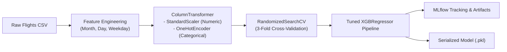
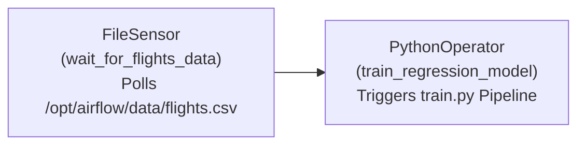
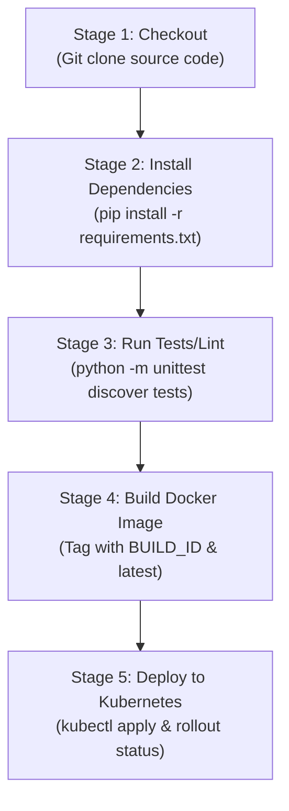

# Flight Price Prediction & MLOps Pipeline (Regression)


This scenario implements an end-to-end, production-grade **Flight Price Prediction System** utilizing Extreme Gradient Boosting (`XGBRegressor`) integrated with an enterprise MLOps lifecycle: **MLflow** experiment tracking, **Flask** REST API serving, **Docker** containerization, **Kubernetes** multi-replica scalability, **Apache Airflow** automated retraining DAGs, and **Jenkins** automated CI/CD.

---

## Table of Contents
1. [Business Objective & Dataset](#1-business-objective--dataset)
2. [Model Architecture & Feature Engineering](#2-model-architecture--feature-engineering)
3. [Experiment Tracking with MLflow](#3-experiment-tracking-with-mlflow)
4. [Real-Time Serving with Flask REST API](#4-real-time-serving-with-flask-rest-api)
5. [Containerization with Docker](#5-containerization-with-docker)
6. [Scalable Orchestration with Kubernetes](#6-scalable-orchestration-with-kubernetes)
7. [Automated Workflows with Apache Airflow](#7-automated-workflows-with-apache-airflow)
8. [Continuous Delivery with Jenkins CI/CD](#8-continuous-delivery-with-jenkins-cicd)
9. [Automated Unit Testing](#9-automated-unit-testing)
10. [Quick Start & Step-by-Step Execution](#10-quick-start--step-by-step-execution)

---

## 1. Business Objective & Dataset

Dynamic flight pricing depends on a complex interplay of temporal factors, route distance, airline agency, and seating classes. The goal is to build an automated regression pipeline that accurately predicts flight fares to support dynamic pricing strategies and cost transparency.

### Dataset Schema (`dataset/flights.csv` — 271,890 records):
- **`travelCode` / `userCode`**: Identifiers linking flight transactions to composite travel itineraries and user profiles.
- **`from` / `to`**: Airport origin and destination cities (e.g., *Recife (PE)*, *Florianopolis (SC)*, *Brasilia (DF)*).
- **`flightType`**: Cabin class (`economic`, `premium`, `firstClass`).
- **`time`**: Flight duration in hours.
- **`distance`**: Flight distance in kilometers.
- **`agency`**: Operating airline agency (`FlyingDrops`, `CloudFy`, `Rainbow`).
- **`date`**: Departure timestamp (`MM/DD/YYYY`).
- **`price`**: Target variable (ticket fare in USD).

---

## 2. Model Architecture & Feature Engineering

The training pipeline in [`src/train.py`](src/train.py) implements a leak-free, modular Scikit-Learn `Pipeline` combined with a `ColumnTransformer`:



### Key Engineering Transformations:
- **Temporal Feature Extraction**: Decomposes `date` into `month`, `day`, and `weekday` to capture seasonal trends and weekend fare surges.
- **Continuous Normalization**: Applies `StandardScaler` to `time`, `distance`, `month`, `day`, and `weekday`.
- **Categorical Encoding**: Applies `OneHotEncoder(handle_unknown='ignore')` to `from`, `to`, `flightType`, and `agency` to guarantee fault-tolerant inference on unseen categories.
- **Hyperparameter Optimization**: Tunes `XGBRegressor` across `n_estimators` (100–500), `learning_rate` (0.01–0.2), `max_depth` (3–9), `subsample` (0.6–1.0), `colsample_bytree` (0.6–1.0), and `min_child_weight` (1–5) via `RandomizedSearchCV`.
- **Evaluation Metrics**: Evaluated on test folds using Root Mean Squared Error (**RMSE**), Mean Absolute Error (**MAE**), and Coefficient of Determination (**R²**).

---

## 3. Experiment Tracking with MLflow

MLflow is integrated directly into [`src/train.py`](src/train.py) to guarantee experiment reproducibility, parameter auditing, and model lineage tracking.

```python
# Experiment Configuration
mlflow.set_tracking_uri("file:///" + os.path.join(project_dir, "mlruns"))
mlflow.set_experiment("flight_price")

with mlflow.start_run():
    # Log hyperparameters from cross-validation
    mlflow.log_params(random_search.best_params_)
    # Log validation metrics
    mlflow.log_metric("rmse", rmse)
    mlflow.log_metric("mae", mae)
    mlflow.log_metric("r2", r2)
    # Log full pipeline artifact
    mlflow.sklearn.log_model(best_model, "model")
```

### Launching and Using the MLflow UI:
```bash
# Launch MLflow tracking server
mlflow ui --backend-store-uri "file:///d:/project/woolf/Voyage Analytics Integrating MLOps in Travel/flight_price/mlruns" --port 5050
```
- Open `http://localhost:5050` in your browser to compare run metrics, view parameter distributions, and download packaged model artifacts.

---

## 4. Real-Time Serving with Flask REST API

The inference service in [`src/app.py`](src/app.py) provides sub-50ms REST endpoints and an interactive web interface.

### Endpoints:
1. **`GET /`**: Renders the modern web UI interface (`src/templates/index.html`).
2. **`GET /health`**: Health probe returning HTTP 200 `{"status": "healthy"}` for Kubernetes readiness/liveness checks.
3. **`POST /predict`**: Real-time inference endpoint.

### Sample Prediction Request:
```powershell
Invoke-RestMethod -Uri "http://127.0.0.1:5000/predict" -Method Post -ContentType "application/json" -Body '{
    "from": "Recife (PE)",
    "to": "Florianopolis (SC)",
    "flightType": "firstClass",
    "agency": "FlyingDrops",
    "date": "2024-10-15",
    "time": 2.5,
    "distance": 680.0
}'
```

### Sample JSON Response:
```json
{
  "predicted_price": 1420.75
}
```

---

## 5. Containerization with Docker

The application is packaged into an immutable Linux container using [`Dockerfile`](Dockerfile):
- **Base Image**: `python:3.11-slim` for minimal image size and fast startup.
- **Production Server**: Runs under **Gunicorn** WSGI application server with multi-worker concurrency binding to `0.0.0.0:5000`.

### Docker Commands:
```bash
# 1. Build the Docker image (run from project root)
docker build -t flight-price-api:latest -f flight_price/Dockerfile .

# 2. Run the container in detached mode
docker run -d -p 5000:5000 --name flight-price-container flight-price-api:latest

# 3. Verify container logs
docker logs flight-price-container

# 4. Test container health
curl http://localhost:5000/health

# 5. Stop and remove container
docker stop flight-price-container && docker rm flight-price-container
```

---

## 6. Scalable Orchestration with Kubernetes

Kubernetes manifests in [`k8s/deployment.yaml`](k8s/deployment.yaml) configure automated self-healing, rolling updates, and traffic distribution.

### Kubernetes Manifest Breakdown:
1. **Deployment (`flight-price-api`)**:
   - **Replicas**: 2 active pod instances.
   - **Resource Requests**: `cpu: 250m`, `memory: 256Mi`.
   - **Resource Limits**: `cpu: 500m`, `memory: 512Mi` (prevents noisy neighbor resource starvation).
2. **Service (`flight-price-service`)**:
   - **Type**: `LoadBalancer` routing external traffic on port `80` to target container port `5000`.

### Kubernetes Commands:
```bash
# 1. Apply Deployment and Service manifests
kubectl apply -f flight_price/k8s/deployment.yaml

# 2. Inspect running pods
kubectl get pods -l app=flight-price-api

# 3. Check service status
kubectl get svc flight-price-service

# 4. Verify deployment rollout
kubectl rollout status deployment/flight-price-api

# 5. Local Port Forwarding (Minikube / Kind)
kubectl port-forward svc/flight-price-service 8080:80
```

---

## 7. Automated Workflows with Apache Airflow

The Airflow DAG in [`airflow/dags/training_dag.py`](airflow/dags/training_dag.py) automates model retraining when new flight transaction data arrives.



### DAG Structure & Implementation Details:
- **DAG ID**: `flight_price_training_pipeline`
- **Schedule**: Daily (`schedule_interval=timedelta(days=1)`) with `catchup=False`.
- **Task 1 (`wait_for_flights_data`)**: `FileSensor` monitoring `/opt/airflow/data/flights.csv` every 30 seconds (`poke_interval=30`) with a 10-minute timeout safeguard (`timeout=600`).
- **Task 2 (`train_regression_model`)**: `PythonOperator` invoking `subprocess.run(['python', script_path])` upon data detection.

### How to Run in Airflow:
```bash
# Set Airflow environment
export AIRFLOW_HOME=~/airflow
mkdir -p $AIRFLOW_HOME/dags $AIRFLOW_HOME/data

# Copy DAG and data
cp flight_price/airflow/dags/training_dag.py $AIRFLOW_HOME/dags/
cp dataset/flights.csv /opt/airflow/data/flights.csv

# Start Airflow in standalone mode
airflow standalone

# Trigger DAG manually via CLI
airflow dags trigger flight_price_training_pipeline
```

---

## 8. Continuous Delivery with Jenkins CI/CD

The declarative [`Jenkinsfile`](Jenkinsfile) automates the end-to-end build, test, and Kubernetes deployment pipeline across 5 stages:



### Jenkinsfile Pipeline Stages:
1. **Checkout**: Retrieves source code from Git repository.
2. **Install Dependencies**: Prepares Python environment using `requirements.txt`.
3. **Run Tests/Lint**: Executes automated unit test suite (`python -m unittest discover tests`).
4. **Build Docker Image**: Builds and tags the Docker image with both the Jenkins build ID (`${env.BUILD_ID}`) and `latest`.
5. **Deploy to Kubernetes**: Applies `k8s/deployment.yaml` and verifies rollout status with zero downtime.

---

## 9. Automated Unit Testing

Unit tests in [`tests/test_api.py`](../tests/test_api.py) validate the API endpoints and input handling:
```bash
# Run unit tests
python -m unittest discover tests
```
- Validates `GET /health` returns HTTP 200 `{"status": "healthy"}`.
- Validates `POST /predict` returns HTTP 400 when an empty payload is provided.

---

## 10. Quick Start & Step-by-Step Execution

```bash
# 1. Install dependencies
pip install -r requirements.txt

# 2. Train model and log to MLflow
python flight_price/src/train.py

# 3. Launch Flask API
python flight_price/src/app.py
# (API available at http://localhost:5000)

# 4. Run unit tests
python -m unittest discover tests

# 5. Build and launch Docker container
docker build -t flight-price-api -f flight_price/Dockerfile .
docker run -d -p 5000:5000 flight-price-api
```
