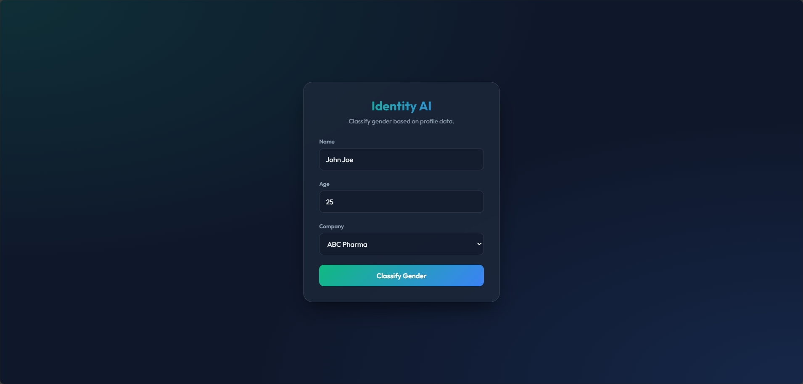

# Gender Classification (Classification)

A classification model designed to predict a user's gender from their profile data.



## Features
- **Model**: Scikit-Learn RandomForestClassifier.
- **REST API**: Flask-based endpoint for real-time classification.
- **Portability**: Includes a Dockerfile for easy deployment.

## Getting Started

1. **Train Model**: `python src/train.py`
2. **Run API**: `python src/app.py` (Port 5001)
3. **Predict**:
   ```powershell
   Invoke-RestMethod -Uri "http://127.0.0.1:5001/classify" -Method Post -ContentType "application/json" -Body '{"age": 25, "company": "4You"}'
   ```
