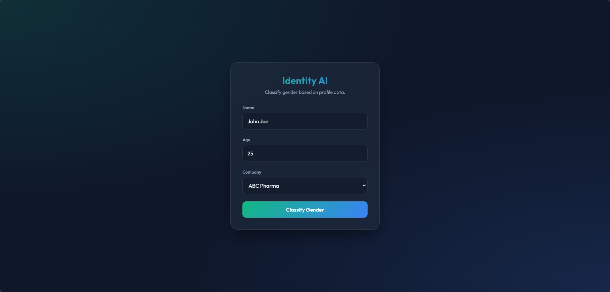
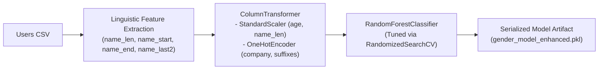

# Gender Classification & Demographic Profiling (Classification)



This scenario builds an intelligent demographic classification service that predicts a user's gender from profile metadata and derived morphological features from user names. It is served via a lightweight **Flask REST API** with an interactive web UI and packaged into an immutable **Docker container**.

---

## Table of Contents
1. [Business Context & Problem Statement](#1-business-context--problem-statement)
2. [Dataset Overview](#2-dataset-overview)
3. [Feature Engineering & Linguistic Extraction](#3-feature-engineering--linguistic-extraction)
4. [Model Training & Pipeline Optimization](#4-model-training--pipeline-optimization)
5. [Real-Time REST API & Web Serving](#5-real-time-rest-api--web-serving)
6. [Containerization with Docker](#6-containerization-with-docker)
7. [Automated Testing & Validation](#7-automated-testing--validation)
8. [Quick Start & Step-by-Step Guide](#8-quick-start--step-by-step-guide)

---

## 1. Business Context & Problem Statement

Demographic profiling enables travel aggregators and booking engines to provide tailored travel packages, gender-specific amenities, and personalized marketing campaigns. When demographic fields are missing or optional during quick user checkouts, machine learning models can infer demographic attributes with high confidence from available account metadata.

---

## 2. Dataset Overview

The model is trained on [`dataset/users.csv`](../dataset/users.csv) containing 1,342 customer profiles:
- **`code`**: Unique user identifier (`0` to `1341`).
- **`company`**: Associated corporate employer (e.g., `4You`, `Monsters`, `Acme`).
- **`name`**: Full name of the user (e.g., `Roy Braun`, `Wilma Mcinnis`).
- **`age`**: Age of the user in years (e.g., `21`, `48`).
- **`gender`**: Target classification label (`male`, `female`, `none`).

---

## 3. Feature Engineering & Linguistic Extraction

Baseline demographic models relying solely on `age` and `company` achieve suboptimal predictive accuracy. In [`src/train.py`](src/train.py), we implement custom morphological and linguistic n-gram extractors on customer names:

```python
def feature_engineering(df):
    # Name string length
    df['name_len'] = df['name'].apply(lambda x: len(str(x)))
    # Starting character (first-letter phonetic cue)
    df['name_start'] = df['name'].apply(lambda x: str(x)[0].lower())
    # Ending character (last-letter morphological cue)
    df['name_end'] = df['name'].apply(lambda x: str(x)[-1].lower())
    # Last 2 characters (suffix morpheme, e.g. 'ia', 'an', 'el')
    df['name_last2'] = df['name'].apply(lambda x: str(x)[-2:].lower())
    return df
```

### Feature Breakdown:
- **`name_len`** (Numeric): Character count of the full name.
- **`name_start`** (Categorical): Initial character.
- **`name_end`** (Categorical): Terminal character (strong gender indicator across many language families).
- **`name_last2`** (Categorical): Terminal 2-gram suffix.
- **`age`** (Numeric): Customer age standardized via `StandardScaler`.
- **`company`** (Categorical): Corporate employer one-hot encoded with `OneHotEncoder(handle_unknown='ignore')`.

---

## 4. Model Training & Pipeline Optimization


```mermaid
flowchart LR
    UsersData["Users CSV"] --> FE["Linguistic Feature Extraction\n(name_len, name_start, name_end, name_last2)"]
    FE --> Preprocessor["ColumnTransformer\n- StandardScaler (age, name_len)\n- OneHotEncoder (company, suffixes)"]
    Preprocessor --> Classifier["RandomForestClassifier\n(Tuned via RandomizedSearchCV)"]
    Classifier --> SaveModel["Serialized Model Artifact\n(gender_model_enhanced.pkl)"]
```

### Training Pipeline Specifications:
- **Algorithm**: `RandomForestClassifier(random_state=42)`
- **Hyperparameter Grid**: Explores `n_estimators` (100, 200, 300), `max_depth` (None, 10, 20, 30), and `min_samples_split` (2, 5, 10).
- **Cross-Validation**: 3-fold cross-validated `RandomizedSearchCV`.
- **Output Artifact**: Serialized to `models/gender_model_enhanced.pkl`.

---

## 5. Real-Time REST API & Web Serving

The Flask application in [`src/app.py`](src/app.py) serves real-time demographic classification.

### Endpoints:
1. **`GET /`**: Serves modern responsive HTML UI (`src/templates/index.html`).
2. **`GET /health`**: Health check probe returning HTTP 200 `{"status": "healthy"}`.
3. **`POST /classify`**: Real-time classification endpoint.

### Sample API Request:
```powershell
Invoke-RestMethod -Uri "http://127.0.0.1:5001/classify" -Method Post -ContentType "application/json" -Body '{
    "name": "Roy Braun",
    "age": 25,
    "company": "4You"
}'
```

### Sample JSON Response:
```json
{
  "gender": "male"
}
```

---

## 6. Containerization with Docker

The service is packaged using [`Dockerfile`](Dockerfile):
- **Base Image**: `python:3.11-slim`
- **WSGI Production Server**: Gunicorn binding on port `5001`.

### Docker Commands:
```bash
# 1. Build the Docker image (from project root)
docker build -t gender-classification-api -f gender_classification/Dockerfile .

# 2. Run the container
docker run -d -p 5001:5001 --name gender-api-container gender-classification-api

# 3. Test container health
curl http://localhost:5001/health

# 4. Stop container
docker stop gender-api-container && docker rm gender-api-container
```

---

## 7. Automated Testing & Validation

Unit tests in [`tests/test_api.py`](../tests/test_api.py) automatically verify:
- `GET /health` returns HTTP 200 OK.
- `POST /classify` handles missing mandatory fields (`name`, `age`, `company`) by returning HTTP 400 Bad Request.

```bash
# Run test suite
python -m unittest discover tests
```

---

## 8. Quick Start & Step-by-Step Guide

```bash
# 1. Install dependencies
pip install -r requirements.txt

# 2. Train the enhanced Random Forest model
python gender_classification/src/train.py

# 3. Launch Flask API service (Port 5001)
python gender_classification/src/app.py

# 4. Test API via PowerShell
Invoke-RestMethod -Uri "http://127.0.0.1:5001/classify" -Method Post -ContentType "application/json" -Body '{"name": "Roy Braun", "age": 25, "company": "4You"}'
```
