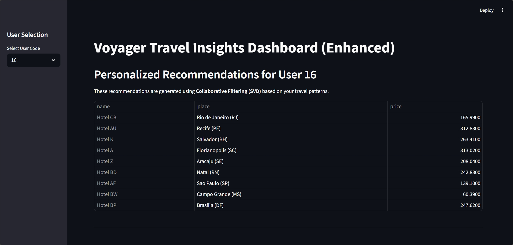

# Travel Recommendation & Dashboard

An interactive solution for exploring travel data and receiving personalized hotel recommendations.

## Features
- **Engine**: Content-based filtering logic to suggest hotels in locations previously visited or liked by the user.
- **Dashboard**: **Streamlit** web application with interactive visualizations and user historical analysis.

## Getting Started

1. **Prepare Assets**: `python src/train.py` (saves recommendation engine assets)
2. **Launch App**: `streamlit run src/streamlit_app.py`

## App Interactivity
- Select a **User Code** in the sidebar to see their specific travel history and personalized recommendations.
- View global price distributions and hotel availability across different locations.
