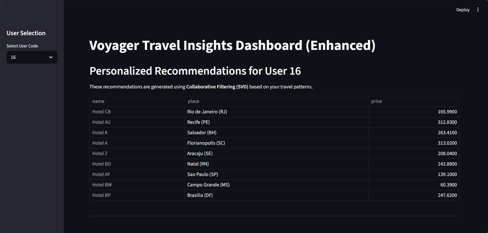
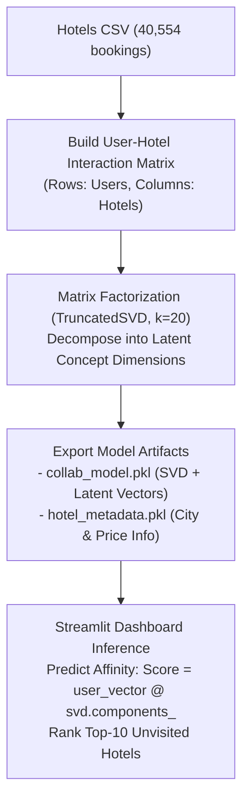

# Travel Recommendation Engine & Analytics Dashboard



This scenario implements a **Personalized Travel & Hotel Recommendation System** utilizing Collaborative Filtering via Matrix Factorization (**TruncatedSVD**). It is deployed through an interactive **Streamlit** web application offering user-level lodging recommendations and global travel business intelligence.

---

## Table of Contents
1. [Business Objective & Dataset](#1-business-objective--dataset)
2. [Recommendation Algorithm & Mathematical Formulation](#2-recommendation-algorithm--mathematical-formulation)
3. [Model Training & Asset Generation](#3-model-training--asset-generation)
4. [Streamlit Interactive Web Application](#4-streamlit-interactive-web-application)
5. [Containerization with Docker](#5-containerization-with-docker)
6. [Quick Start & Step-by-Step Guide](#6-quick-start--step-by-step-guide)

---

## 1. Business Objective & Dataset

Personalization in travel is essential to maximize booking conversions and customer loyalty. Instead of showing identical generic hotel listings to all users, this recommendation engine discovers latent affinities between travelers and accommodations based on historical booking frequencies.

### Dataset Overview (`dataset/hotels.csv` — 40,554 records):
- **`travelCode` / `userCode`**: Identifiers linking lodging stays to composite itineraries and customer profiles.
- **`name`**: Hotel name (e.g., `Hotel A`, `Hotel K`, `Hotel BD`).
- **`place`**: Destination city (e.g., `Florianopolis (SC)`, `Salvador (BH)`, `Sao Paulo (SP)`).
- **`days`**: Duration of stay in days.
- **`price`**: Nightly lodging rate in USD.
- **`total`**: Total booking price in USD.
- **`date`**: Check-in timestamp (`MM/DD/YYYY`).

---

## 2. Recommendation Algorithm & Mathematical Formulation

The recommendation engine in [`src/train.py`](src/train.py) uses **Collaborative Filtering via Truncated Singular Value Decomposition (SVD)**:


```mermaid
flowchart TD
    HotelsData["Hotels CSV (40,554 bookings)"] --> MatrixBuild["Build User-Hotel Interaction Matrix\n(Rows: Users, Columns: Hotels)"]
    MatrixBuild --> SVD["Matrix Factorization (TruncatedSVD, k=20)\nDecompose into Latent Concept Dimensions"]
    SVD --> ModelExport["Export Model Artifacts\n- collab_model.pkl (SVD + Latent Vectors)\n- hotel_metadata.pkl (City & Price Info)"]
    ModelExport --> Serving["Streamlit Dashboard Inference\nPredict Affinity: Score = user_vector @ svd.components_\nRank Top-10 Unvisited Hotels"]
```

### Mathematical Formulation:
1. **User-Item Interaction Matrix ($\mathbf{R}_{m \times n}$)**: Constructed by aggregating the count of historical visits per `(userCode, hotel_name)` pair.
2. **Matrix Decomposition**:
   $$\mathbf{R}_{m \times n} \approx \mathbf{U}_{m \times k} \cdot \mathbf{\Sigma}_{k \times k} \cdot \mathbf{V}_{k \times n}^T$$
   Where $k=20$ latent components capture underlying travel patterns (e.g., luxury business vs. budget leisure).
3. **Inference Affinity Scoring**:
   For an active user vector $\mathbf{u}_i$ in the latent subspace:
   $$\hat{\mathbf{r}}_i = \mathbf{u}_i \cdot \mathbf{V}^T$$
   The resulting scores represent the user's predicted affinity across all candidate hotels. The system filters out properties and returns the top-10 ranked recommendations.

---

## 3. Model Training & Asset Generation

In [`src/train.py`](src/train.py), the collaborative model is trained and serialized:

```bash
# Run training script
python travel_recommendation/src/train.py
```

### Serialized Outputs:
- **`models/collab_model.pkl`**: Dictionary containing the fitted `TruncatedSVD` model, user indices, hotel column labels, user latent representations (`matrix_reduced`), and reconstruction RMSE.
- **`models/hotel_metadata.pkl`**: Clean lookup DataFrame containing hotel names, location cities, and nightly prices.

---

## 4. Streamlit Interactive Web Application

The user-facing dashboard in [`src/app.py`](src/app.py) provides a responsive analytical interface:

### Features & Interactivity:
1. **User Selection Sidebar**: Select any registered `userCode` from a sorted dropdown.
2. **Personalized Recommendations**: Instantaneously computes latent dot products and presents the curated top-10 recommended hotels with pricing and location metadata in a clean tabular view.
3. **Price Distribution Analysis**: Interactive bar chart displaying average lodging prices across popular destinations (e.g., *Florianopolis*, *Recife*, *Sao Paulo*).
4. **Destination Popularity**: Bar chart showing transaction volumes across travel destinations.

### Running the App:
```bash
streamlit run travel_recommendation/src/app.py
```
- Open `http://localhost:8501` in your browser.

---

## 5. Containerization with Docker

The dashboard is containerized using [`Dockerfile`](Dockerfile):
- **Base Image**: `python:3.11-slim`
- **Exposed Port**: `8501` (Streamlit default)
- **Health Check**: Integrated `HEALTHCHECK` probe against `http://localhost:8501/_stcore/health`.

### Docker Commands:
```bash
# 1. Build Docker image (from project root)
docker build -t travel-recommendation-app -f travel_recommendation/Dockerfile .

# 2. Run container
docker run -d -p 8501:8501 --name travel-rec-container travel-recommendation-app

# 3. Access Dashboard
# Open http://localhost:8501 in your browser

# 4. Stop and remove container
docker stop travel-rec-container && docker rm travel-rec-container
```

---

## 6. Quick Start & Step-by-Step Guide

```bash
# 1. Install dependencies
pip install -r requirements.txt

# 2. Train recommendation model
python travel_recommendation/src/train.py

# 3. Launch Streamlit web dashboard
streamlit run travel_recommendation/src/app.py
```
